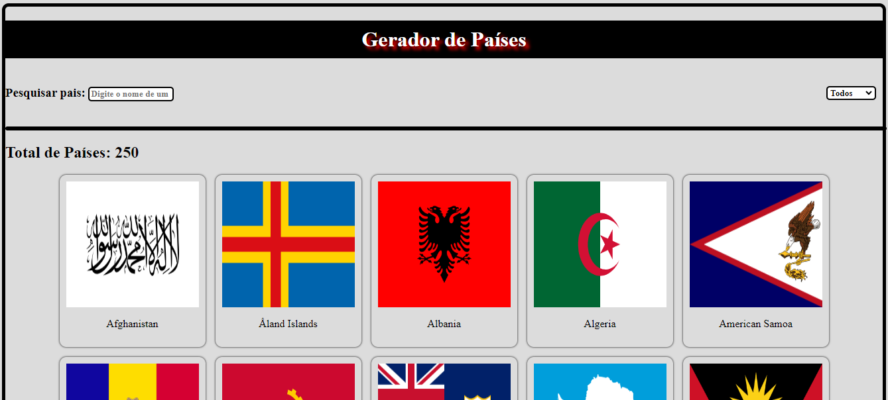

# Sobre o projeto

Integração com a API https://restcountries.com/v3.1/ para pegar dados de países e exibir em uma página, o objetivo é colocar em prática conhecimentos já aprendidos na disciplina de PROGRAMAÇÃO WEB I. O projeto foi construído com HTML, CSS e JS. Pude colocar em prática meus conhecimentos em responvidade, flexbox, grid layout, classes, manipulação de elementos, LocalStorage, função IIFE, função assíncronas método map, forEach e etc.

## Desing do Projeto

Exemplo de Resultado:

## API Utilizada

api (https://restcountries.com/v3.1/)

# Funcionalidades:

Ver todos os países da API na página principal 
Mostrar todos os países na página principal
Cada país deve conter: bandeira; nome; qtd população; região; capital;
Criar interface para mostrar todos os países.

Procurar por um país atráves de um input
Capturar nome do país digitado
Comparar com o nome que foi pegado na API
Fazer comparação a cada letra digitada
Mostrar o país encontrado, esconder os outros que não são iguais ao digitado
O resultado da pesquisa tem que ir mudando conforme o usuário vai digitando ou apagando o que for digitado

Filtro por região
Criar select com as opções
Capturar filtro selecionado
omparar o filtro selecionado com todos os países
Mostrar na interface apenas os países da região selecionada
Corrigir bug: Ao voltar para o default option não estava renderizando nenhum páis
Corrigir bug: Uncaught TypeError: Cannot read properties of undefined (reading 'style') que foi gerado ao resolver a etapa anterior
